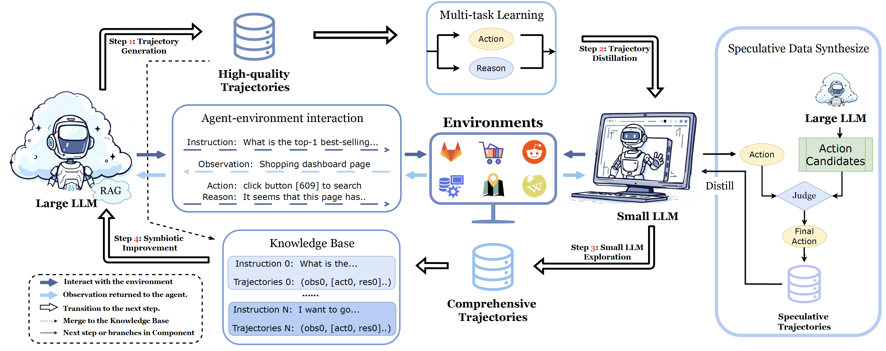

# [Symbiotic Cooperation for Web Agents: Harnessing Complementary Strengths of Large and Small LLMs](https://www.arxiv.org/abs/2502.07942)

  

This repository contains the implementation of [**AgentSymbiotic**], an advanced web agent framework. It introduces a **symbiotic learning framework** that enables **large language models (LLMs)** and **small language models (SLLMs)** to enhance each other iteratively, achieving superior performance in web-based automation tasks. Our code is built upon [AgentOccam](https://github.com/amazon-science/AgentOccam).
## 🚀 Key Features

- **Mutual Improvement Between LLMs and SLLMs**  
  - Large LLMs generate high-quality trajectory data.  
  - Distilled small LLMs explore diverse strategies, enriching the dataset.  
- **Enhanced Knowledge Distillation**
  - **Speculative Data Synthesis**: Mitigates off-policy bias and improves SLLM adaptation.  
  - **Multi-Task Learning**: Enhances reasoning capabilities of small LLMs.  
- **Hybrid Mode for Privacy Preservation**  
  - Automatically switches to local SLLMs when handling sensitive data.  
- **State-of-the-Art Performance**  
  - Achieved **52%** success rate with large LLMs and **49%** with distilled small LLMs on the **WEBARENA** benchmark.